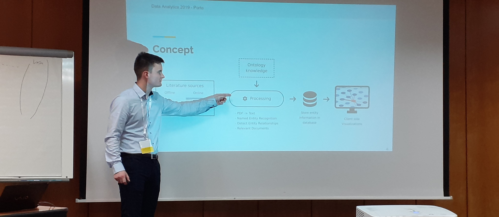

# Philipp Kief

Hi, I'm Philipp - a professional web developer with a passion for nearly all things that are running in a web browser. When it comes to innovative projects, architectural decisions as well as the creative and visual design of user interfaces, I'm really excited. It is a pleasure for me to try new technologies and libraries, I am active in the open source environment frequently, enjoy writing articles on Medium or get involved as an active member on Stack Overflow.

## ✨ Languages

- TypeScript 
- EcmaScript 
- Python 
- HTML/CSS/Scss 

## 💻 Projects

- [VS Code Material Icon Theme](https://github.com/PKief/vscode-material-icon-theme)
- [VS Code Markdown Checkbox](https://github.com/PKief/vscode-markdown-checkbox)
- [Angular Events Chatbot](https://github.com/PKief/angular-events-chatbot)
- [Checkbox Snake Game](https://github.com/PKief/checkbox-snake)

## 📖 Articles

- [Automatic Dark Mode Detection in Angular](https://medium.com/@PhilippKief/automatic-dark-mode-detection-in-angular-material-8342917885a0)
- [How to debug TypeScript with VS Code](https://medium.com/@PhilippKief/how-to-debug-typescript-with-vs-code-9cec93b4ae56)
- [How to create Angular Desktop Apps](https://medium.com/@PhilippKief/angular-desktop-apps-a9ce9e3574e8)
